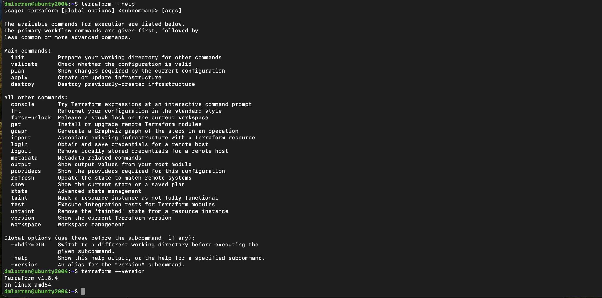
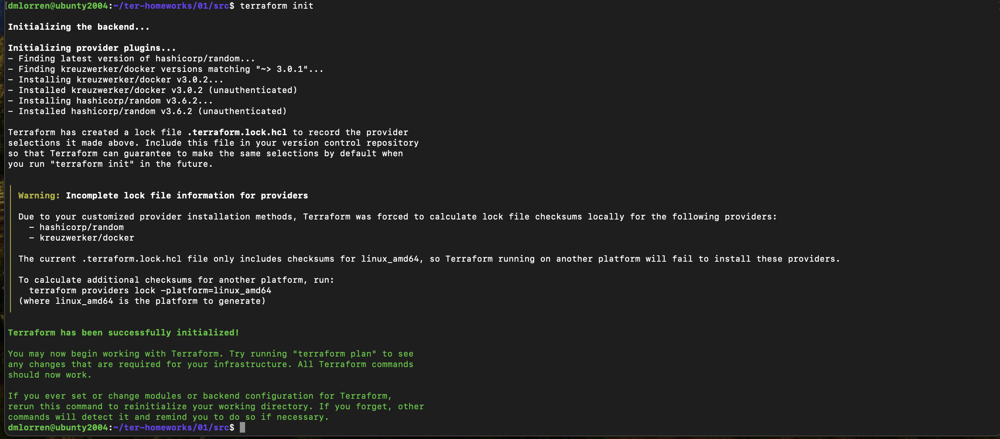
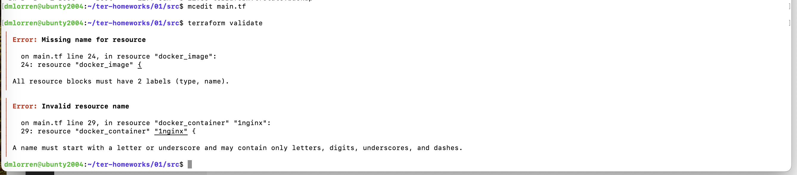
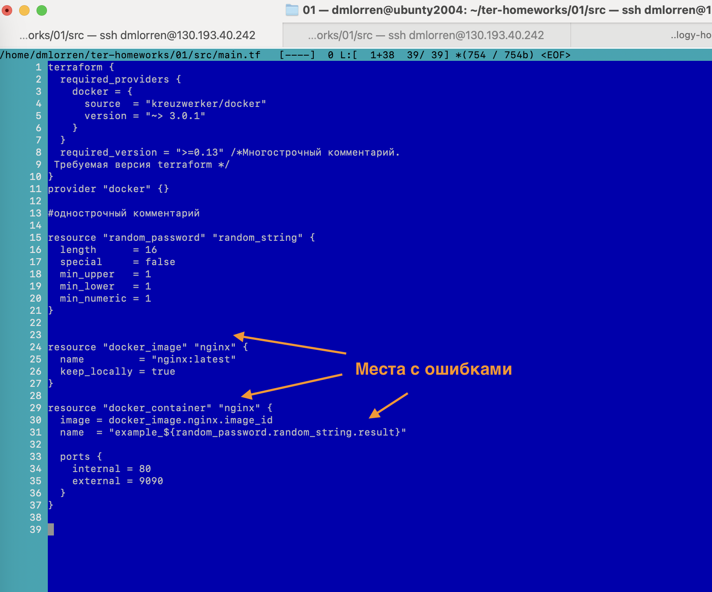
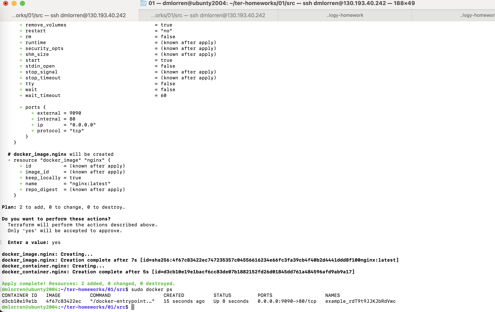
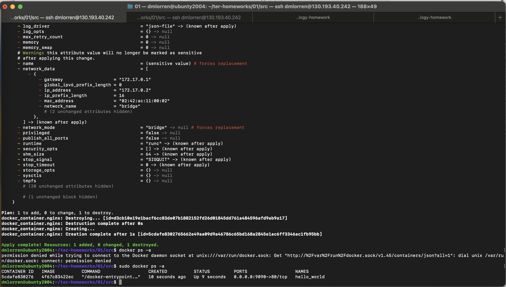
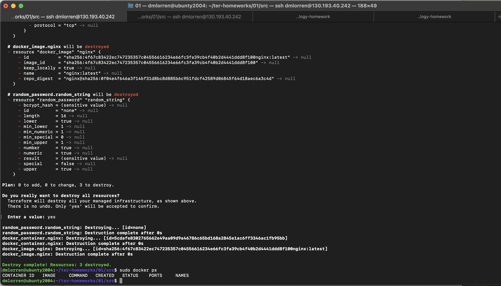
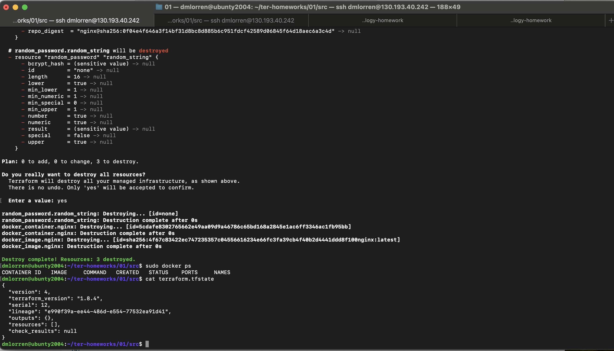
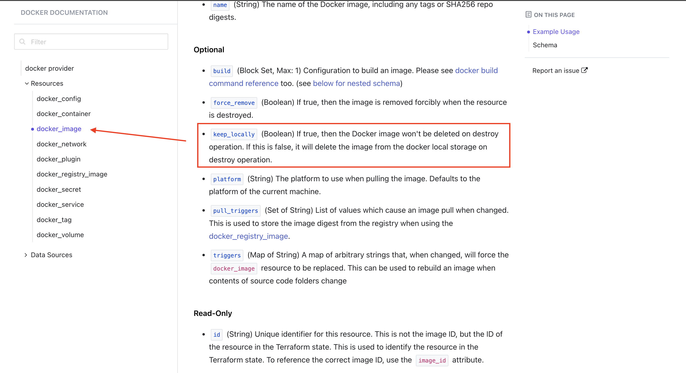

# Домашнее задание к занятию «Введение в Terraform» - Иванов Дмитрий (fops-13)

### Цели задания

1. Установить и настроить Terrafrom.
2. Научиться использовать готовый код.

------

### Чек-лист готовности к домашнему заданию

1. Скачайте и установите **Terraform** версии =1.5.Х (версия 1.6 может вызывать проблемы с Яндекс провайдером) . Приложите скриншот вывода команды ```terraform --version```.
2. Скачайте на свой ПК этот git-репозиторий. Исходный код для выполнения задания расположен в директории **01/src**.
3. Убедитесь, что в вашей ОС установлен docker.
4. Зарегистрируйте аккаунт на сайте https://hub.docker.com/, выполните команду docker login и введите логин, пароль.

------

### Инструменты и дополнительные материалы, которые пригодятся для выполнения задания

1. Репозиторий с ссылкой на зеркало для установки и настройки Terraform: [ссылка](https://github.com/netology-code/devops-materials).
2. Установка docker: [ссылка](https://docs.docker.com/engine/install/ubuntu/). 
------
### Внимание!! Обязательно предоставляем на проверку получившийся код в виде ссылки на ваш github-репозиторий!
------

### Задание 1

1. Перейдите в каталог [**src**](https://github.com/netology-code/ter-homeworks/tree/main/01/src). Скачайте все необходимые зависимости, использованные в проекте. 
2. Изучите файл **.gitignore**. В каком terraform-файле, согласно этому .gitignore, допустимо сохранить личную, секретную информацию?
3. Выполните код проекта. Найдите  в state-файле секретное содержимое созданного ресурса **random_password**, пришлите в качестве ответа конкретный ключ и его значение.
4. Раскомментируйте блок кода, примерно расположенный на строчках 29–42 файла **main.tf**.
Выполните команду ```terraform validate```. Объясните, в чём заключаются намеренно допущенные ошибки. Исправьте их.
5. Выполните код. В качестве ответа приложите: исправленный фрагмент кода и вывод команды ```docker ps```.
6. Замените имя docker-контейнера в блоке кода на ```hello_world```. Не перепутайте имя контейнера и имя образа. Мы всё ещё продолжаем использовать name = "nginx:latest". Выполните команду ```terraform apply -auto-approve```.
Объясните своими словами, в чём может быть опасность применения ключа  ```-auto-approve```. Догадайтесь или нагуглите зачем может пригодиться данный ключ? В качестве ответа дополнительно приложите вывод команды ```docker ps```.
7. Уничтожьте созданные ресурсы с помощью **terraform**. Убедитесь, что все ресурсы удалены. Приложите содержимое файла **terraform.tfstate**. 
8. Объясните, почему при этом не был удалён docker-образ **nginx:latest**. Ответ **ОБЯЗАТЕЛЬНО НАЙДИТЕ В ПРЕДОСТАВЛЕННОМ КОДЕ**, а затем **ОБЯЗАТЕЛЬНО ПОДКРЕПИТЕ** строчкой из документации [**terraform провайдера docker**](https://docs.comcloud.xyz/providers/kreuzwerker/docker/latest/docs).  (ищите в классификаторе resource docker_image )


## Решение задачи 1

- Шпаргалка:
```
1. terraform init: Эта команда инициализирует текущий рабочий каталог и загружает все необходимые плагины и провайдеры, которые указаны в файле конфигурации Terraform.

2. terraform plan: Команда plan используется для создания плана изменений в вашей инфраструктуре. Она анализирует текущую конфигурацию и сравнивает её с желаемой, показывая какие ресурсы будут созданы, изменены или удалены.

3. terraform apply: При помощи apply Terraform применяет изменения, указанные в вашем плане. Перед применением изменений он также запросит подтверждение от пользователя.

4. terraform destroy: Данная команда используется для удаления всех ресурсов, управляемых Terraform, которые определены в текущей конфигурации. Она выполняет обратный процесс к apply, удаляя все созданные ресурсы.

5. terraform validate: Команда validate используется для проверки вашей конфигурации Terraform на наличие синтаксических ошибок. 

6. terraform get: Команда get используется для загрузки и установки дополнительных модулей, провайдеров или других ресурсов, которые могут быть указаны в файле конфигурации.

7. terraform show: Данная команда отображает текущее состояние инфраструктуры в формате удобном для чтения.

8. terraform state: Команда state позволяет управлять состоянием инфраструктуры, позволяя, например, удалить, переместить или изменить состояние ресурса.
```


1. Перейдите в каталог [**src**](https://github.com/netology-code/ter-homeworks/tree/main/01/src). Скачайте все необходимые зависимости, использованные в проекте. 



2. Изучите файл **.gitignore**. В каком terraform-файле, согласно этому .gitignore, допустимо сохранить личную, секретную информацию?

- Согласно файлу .gitignore хранить личную информацию можно только в файле personal.auto.tfvars .

```
dmlorren@ubunty2004:~/ter-homeworks/01/src$ cat .gitignore 
# Local .terraform directories and files
**/.terraform/*
.terraform*

!.terraformrc

# .tfstate files
*.tfstate
*.tfstate.*

# own secret vars store.
personal.auto.tfvars
```

3. Выполните код проекта. Найдите  в state-файле секретное содержимое созданного ресурса **random_password**, пришлите в качестве ответа конкретный ключ и его значение.

- Ответ:
```
"result": "rdT9t9JJKJbRdVwc"
```

4. Раскомментируйте блок кода, примерно расположенный на строчках 29–42 файла **main.tf**.
5. Выполните команду ```terraform validate```. Объясните, в чём заключаются намеренно допущенные ошибки. Исправьте их.




Ответ:
- Отметил место где были допущены ошибки (на данном скриншоте всё исправлено):


- После исправления валидация проходит успешно
```
dmlorren@ubunty2004:~/ter-homeworks/01/src$ terraform validate
Success! The configuration is valid.
```



6. Замените имя docker-контейнера в блоке кода на ```hello_world```. Не перепутайте имя контейнера и имя образа. Мы всё ещё продолжаем использовать name = "nginx:latest". Выполните команду ```terraform apply -auto-approve```.

- Заменяю имя образа:
```
resource "docker_container" "nginx" {
       image = docker_image.nginx.image_id
       name  = "hello_world"
```




Объясните своими словами, в чём может быть опасность применения ключа  ```-auto-approve```. Догадайтесь или нагуглите зачем может пригодиться данный ключ? В качестве ответа дополнительно приложите вывод команды ```docker ps```.

- Ответ:
```text
Ключ -auto-approve в Terraform используется для автоматического подтверждения (одобрения) применения изменений инфраструктуры без необходимости вручную подтверждать каждый шаг. Этот ключ может быть опасным, так как он убирает возможность провести внимательную проверку изменений, которые будут применены, и может привести к нежелательным результатам, если некорректные или неожиданные изменения попадут в рабочую среду.

Использование ключа -auto-approve может быть удобно при автоматизации процессов или в случаях, когда исполнение Terraform процесса не требует ручной проверки. Однако, рекомендуется использовать его с осторожностью и учитывать потенциальные риски, связанные с автоматическим утверждением изменений. 
```

7. Уничтожьте созданные ресурсы с помощью **terraform**. Убедитесь, что все ресурсы удалены. Приложите содержимое файла **terraform.tfstate**. 

- Ответ:




8.  Объясните, почему при этом не был удалён docker-образ **nginx:latest**. Ответ **ОБЯЗАТЕЛЬНО НАЙДИТЕ В ПРЕДОСТАВЛЕННОМ КОДЕ**, а затем **ОБЯЗАТЕЛЬНО ПОДКРЕПИТЕ** строчкой из документации [**terraform провайдера docker**](https://docs.comcloud.xyz/providers/kreuzwerker/docker/latest/docs).  (ищите в классификаторе resource docker_image )

- Ответ:
```text
Параметр keep_locally = true в ресурсе dockerimage указывает на то, что Terraform должен сохранить это образ Docker локально после его загрузки. Это значит, что Terraform будет хранить копию образа на машине, на которой выполняется команда terraform apply или terraform plan, чтобы при последующих запусках не требовалось скачивать образ снова. 

Опция полезна, если нужно ускорить процесс развертывания, особенно если образ Docker относительно большой и его загрузка из репозитория занимает время. Однако, необходимо учитывать, что это также может занимать дополнительное место на диске, особенно при работе с большим количеством образов и при частом обновлении образов.
```

- выдержка из конфига:
```
resource "docker_image" "nginx" {
       name         = "nginx:latest"
       keep_locally = true
```

- выдержка из документации:


------


