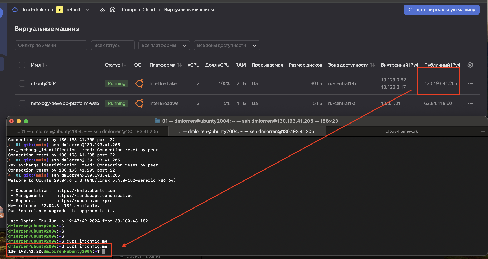
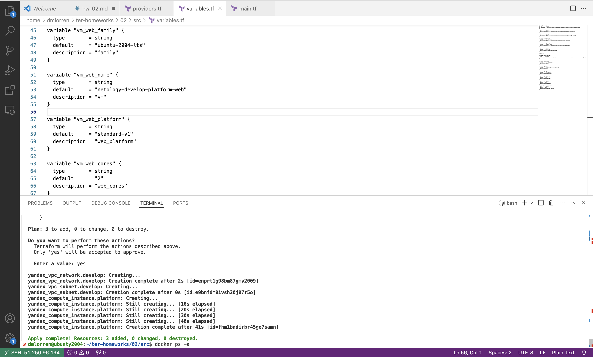
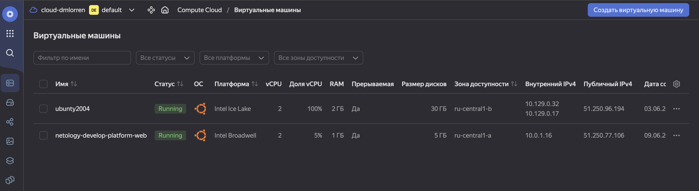
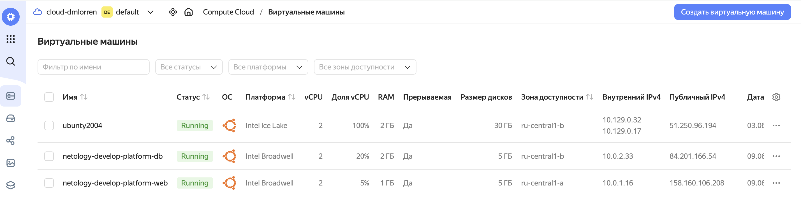
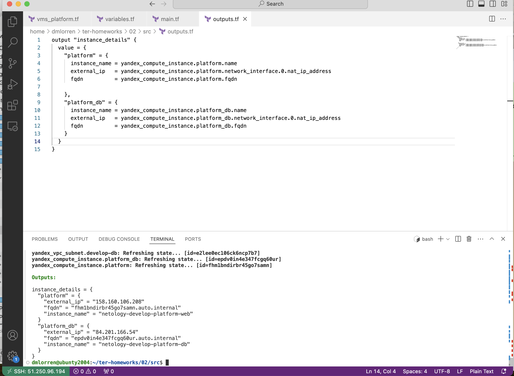
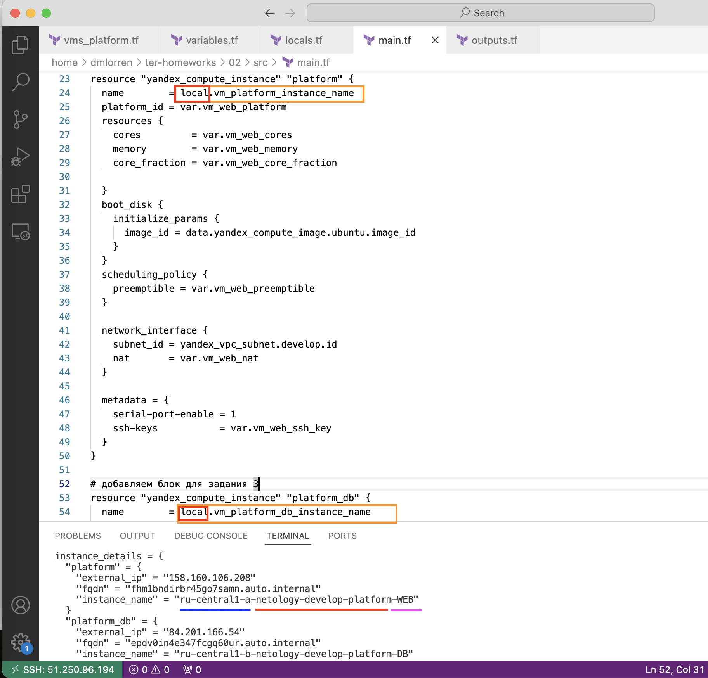
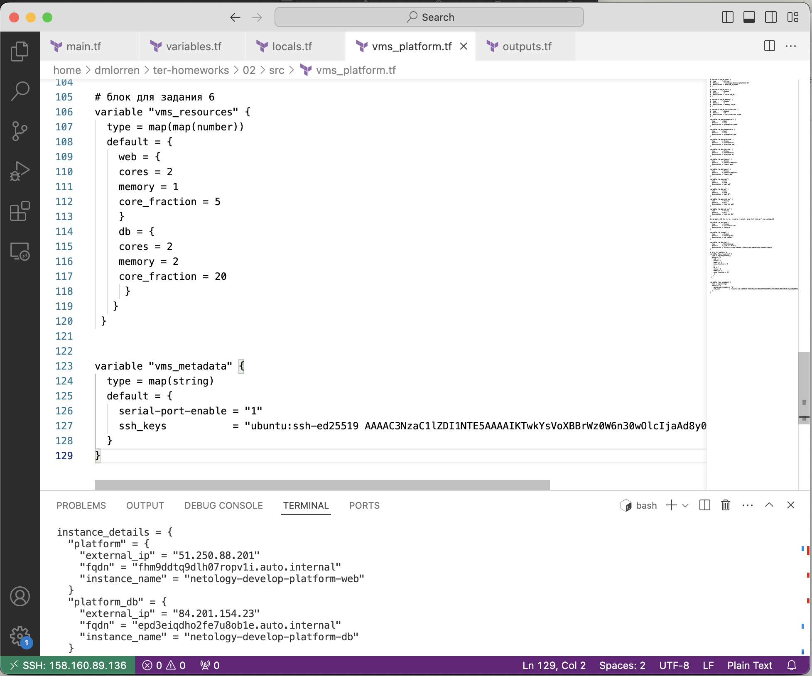

# Домашнее задание к занятию «Основы Terraform. Yandex Cloud»

### Цели задания

1. Создать свои ресурсы в облаке Yandex Cloud с помощью Terraform.
2. Освоить работу с переменными Terraform.

### Чек-лист готовности к домашнему заданию

1. Зарегистрирован аккаунт в Yandex Cloud. Использован промокод на грант.
2. Установлен инструмент Yandex CLI.
3. Исходный код для выполнения задания расположен в директории [**02/src**](https://github.com/netology-code/ter-homeworks/tree/main/02/src).


### Задание 0

1. Ознакомьтесь с [документацией к security-groups в Yandex Cloud](https://cloud.yandex.ru/docs/vpc/concepts/security-groups?from=int-console-help-center-or-nav). 
Этот функционал понадобится к следующей лекции.

------
### Внимание!! Обязательно предоставляем на проверку получившийся код в виде ссылки на ваш github-репозиторий!
------

### Задание 1
В качестве ответа всегда полностью прикладывайте ваш terraform-код в git.  Убедитесь что ваша версия **Terraform** =1.5.Х (версия 1.6.Х может вызывать проблемы с Яндекс провайдером) 

1. Изучите проект. В файле variables.tf объявлены переменные для Yandex provider.
2. Создайте сервисный аккаунт и ключ. [service_account_key_file](https://terraform-provider.yandexcloud.net).
4. Сгенерируйте новый или используйте свой текущий ssh-ключ. Запишите его открытую(public) часть в переменную **vms_ssh_public_root_key**.
5. Инициализируйте проект, выполните код. Исправьте намеренно допущенные синтаксические ошибки. Ищите внимательно, посимвольно. Ответьте, в чём заключается их суть.
6. Подключитесь к консоли ВМ через ssh и выполните команду ``` curl ifconfig.me```.
Примечание: К OS ubuntu "out of a box, те из коробки" необходимо подключаться под пользователем ubuntu: ```"ssh ubuntu@vm_ip_address"```. Предварительно убедитесь, что ваш ключ добавлен в ssh-агент: ```eval $(ssh-agent) && ssh-add``` Вы познакомитесь с тем как при создании ВМ создать своего пользователя в блоке metadata в следующей лекции.;
8. Ответьте, как в процессе обучения могут пригодиться параметры ```preemptible = true``` и ```core_fraction=5``` в параметрах ВМ.

В качестве решения приложите:

- скриншот ЛК Yandex Cloud с созданной ВМ, где видно внешний ip-адрес;
- скриншот консоли, curl должен отобразить тот же внешний ip-адрес;
- ответы на вопросы.

### Решение задания 1

напоминание для себя:
1. поднимаем в облаке vm + сервисный аккаунт и Create authorized key (тут была проблема я копировал ключ руками через vsc и вставлял через nano из-за чего пришлось править путь в providers.tf для service_account_key_file = file("/home/dmlorren/authorized_key.json")), так делать не надо. 
2. прокидываем ключ из id_ed25519.pub (локальная vm тачка) в variables.tf в секцию с переменной variable "vms_ssh_root_key"


3. при выполнении команды terraform apply запросили яндекс токен, про него читать тут
https://yandex.cloud/ru/docs/iam/concepts/authorization/oauth-token


команды:
```
dmlorren@ubunty2004:~/ter-homeworks/02/src$ terraform init
dmlorren@ubunty2004:~/ter-homeworks/02/src$ terraform validate
dmlorren@ubunty2004:~/ter-homeworks/02/src$ ssh-keygen -t ed25519
dmlorren@ubunty2004:~/ter-homeworks/02/src$ cat /home/dmlorren/.ssh/id_ed25519.pub
dmlorren@ubunty2004:~/ter-homeworks/02/src$ terraform apply
```

- Выполняем terraform apply, вводим id облака и id папки и токен oauth.yandex затем разбираем с ошибками:
```
│ Error: Error while requesting API to create instance: server-request-id = 6fb005ec-0cee-4151-b93f-34c9efa2260a server-trace-id = 615c5ea4e8bc6b2b:41fd2354ab535109:615c5ea4e8bc6b2b:1 client-request-id = 67c77ab5-2fa2-4719-8f50-5477dcb7a821 client-trace-id = 2a9dd2eb-ba34-48a8-91a6-c82e6c7cf84b rpc error: code = FailedPrecondition desc = Platform "standart-v4" not found
```



- Ошибки: 
1. platform_id = "standart-v4" - неверное указание платформы, "v4" изменено на "v1", 
2. "standart" на "standard" для платформы 'standard-v1" 
3. некорректное значение числа ядер, изменено на cores = 2

- Ответы:
```text
параметр preemptible - прерываемая ВМ, останавливается не позднее 24 часов, может быть остановлена YC в любой момент при неватке ресурсов в зоне доступности. Позволяет экономить средства на аккаунте в случае, если ВМ не была выключена.
параметр core_fraction - гарантированнаая доля vCPU, которая будет выделена vm.
```

------

### Задание 2

1. Замените все хардкод-**значения** для ресурсов **yandex_compute_image** и **yandex_compute_instance** на **отдельные** переменные. К названиям переменных ВМ добавьте в начало префикс **vm_web_** .  Пример: **vm_web_name**.
2. Объявите нужные переменные в файле variables.tf, обязательно указывайте тип переменной. Заполните их **default** прежними значениями из main.tf. 
3. Проверьте terraform plan. Изменений быть не должно. 

### Решение задания 2




------

### Задание 3

1. Создайте в корне проекта файл 'vms_platform.tf' . Перенесите в него все переменные первой ВМ.
2. Скопируйте блок ресурса и создайте с его помощью вторую ВМ в файле main.tf: **"netology-develop-platform-db"** ,  ```cores  = 2, memory = 2, core_fraction = 20```. Объявите её переменные с префиксом **vm_db_** в том же файле ('vms_platform.tf').  ВМ должна работать в зоне "ru-central1-b"
3. Примените изменения.

### Решение задания 3



------

### Задание 4

1. Объявите в файле outputs.tf **один** output , содержащий: instance_name, external_ip, fqdn для каждой из ВМ в удобном лично для вас формате.(без хардкода!!!)
2. Примените изменения.

В качестве решения приложите вывод значений ip-адресов команды ```terraform output```.


### Решение задания 4

```
Outputs:

instance_details = {
  "platform" = {
    "external_ip" = "158.160.106.208"
    "fqdn" = "fhm1bndirbr45go7samn.auto.internal"
    "instance_name" = "netology-develop-platform-web"
  }
  "platform_db" = {
    "external_ip" = "84.201.166.54"
    "fqdn" = "epdv0in4e347fcgq60ur.auto.internal"
    "instance_name" = "netology-develop-platform-db"
  }
}
```


------

### Задание 5

1. В файле locals.tf опишите в **одном** local-блоке имя каждой ВМ, используйте интерполяцию ${..} с НЕСКОЛЬКИМИ переменными по примеру из лекции.
2. Замените переменные внутри ресурса ВМ на созданные вами local-переменные.
3. Примените изменения.


### Решение задания 5
- заполняем locals.tf
```
# все локальные переменные должны быть описаны в variables
# переменные zone выдернуты из variables (по дефолту) и vms_platform
# vm_platform_instance_name и vm_platform_db_instance_name нужно закинуть в main.tf в блок с ресурсами

locals {
  vm_platform_instance_name = "${var.default_zone}-${var.instance}-${var.name_web}"
  vm_platform_db_instance_name  = "${var.vm_db_zone}-${var.instance}-${var.name_db}"
}
```
- в variables.tf описываем нужные переменные они прокидываются в local.tf (за исключением переменных default_zone и vm_db_zone)
```
# новые переменные для задания 5

variable "instance" {
  type        = string
  default = "netology-develop-platform"
}

variable "name_web" {
  type        = string
  default = "WEB"
}

variable "name_db" {
  type        = string
  default = "DB"
}
```


------

### Задание 6

1. Вместо использования трёх переменных  ".._cores",".._memory",".._core_fraction" в блоке  resources {...}, объедините их в единую map-переменную **vms_resources** и  внутри неё конфиги обеих ВМ в виде вложенного map.  
   ```
   пример из terraform.tfvars:
   vms_resources = {
     web={
       cores=
       memory=
       core_fraction=
       ...
     },
     db= {
       cores=
       memory=
       core_fraction=
       ...
     }
   }
   ```
3. Создайте и используйте отдельную map переменную для блока metadata, она должна быть общая для всех ваших ВМ.
   ```
   пример из terraform.tfvars:
   metadata = {
     serial-port-enable = 1
     ssh-keys           = "ubuntu:ssh-ed25519 AAAAC..."
   }
   ```  
  
5. Найдите и закоментируйте все, более не используемые переменные проекта.
6. Проверьте terraform plan. Изменений быть не должно.


### Решение задания 6

- Сразу поправлю своё пятое задание, нельзя пихать в переменные заглавнными буквами, т.е вот так делать нельзя default = "WEB", это я понял когда потратив 4 часа полностью перелопатил свои конфиги.

иначе будет вот такая боль:
``` 
│ Error: Error while requesting API to create instance: server-request-id = 757e8243-e1b8-4566-98ff-080ea82895c3 server-trace-id = e9be85ca6a0b9945:57358e23d8314bb2:e9be85ca6a0b9945:1 client-request-id = 24887d7b-bb3d-4c4f-8a1d-5bdcd34b4c27 client-trace-id = f5a24c2f-9d43-41ae-bd77-b1b7deb19be4 rpc error: code = InvalidArgument desc = Request validation error: Name: invalid resource name
│ 
│   with yandex_compute_instance.platform_db,
│   on main.tf line 53, in resource "yandex_compute_instance" "platform_db":
│   53: resource "yandex_compute_instance" "platform_db" {
``` 

- ответ:


------